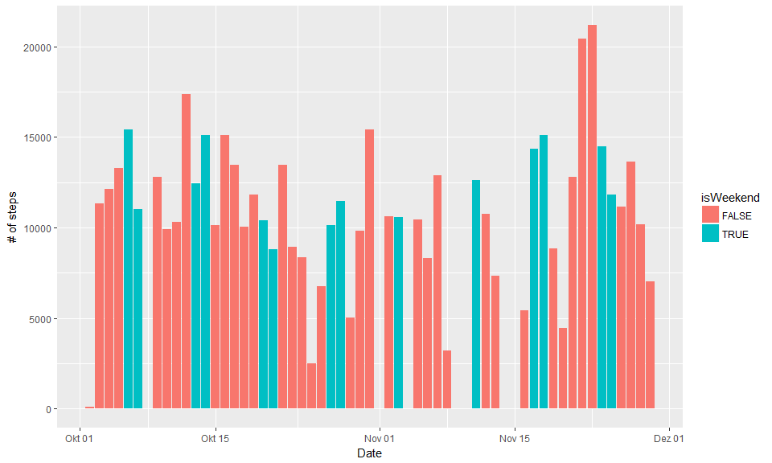
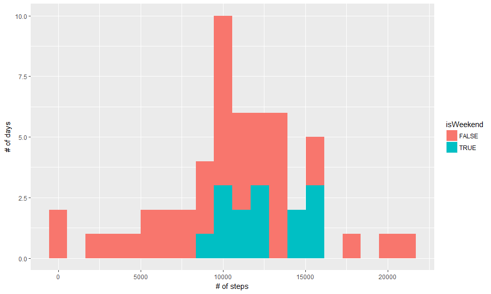
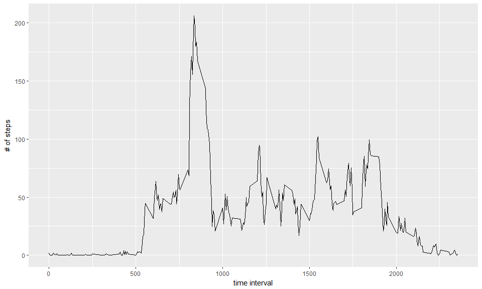
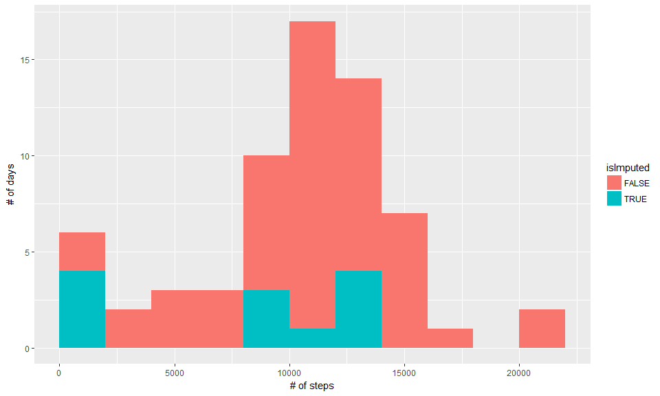
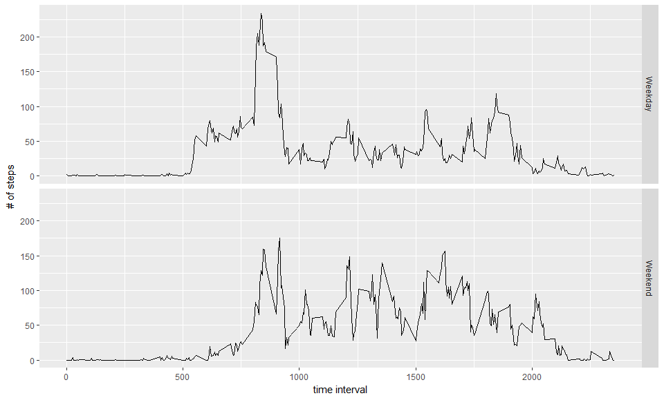

# Reproducible Research: Analyzing activity patterns
Matthias Schmitt  
14 Januar 2017  


## Project goal & data setup  

As described on the course website, we use ''data from a personal activity monitoring device. This device collects data at 5 minute intervals through out the day. The data consists of two months of data from an anonymous individual collected during the months of October and November, 2012 and include the number of steps taken in 5 minute intervals each day.'' We analyze a set of questions related to activity patterns in the data, especially the difference between weekdays and weekends. We first read the data:


```r
# for local data file
# activity <- read.csv("D:/Documents/R/data-science/reproducible/activity.csv")

# auto-download from web source
temp <- tempfile()
download.file("http://d396qusza40orc.cloudfront.net/repdata%2Fdata%2Factivity.zip",temp)
unzip(temp)
unlink(temp)

activity <- read.csv("activity.csv")
```

Since we need to work with the *date* variable a lot later, we transform it here, and introduce the flag *isWeekend*, which we need later to analyse patterns on weekends separately from those during the week. 


```r
activity$date <- as.Date(activity$date)

# there's a base R function for getting the weekdays, but I use the lubridate version
# to make it work on all locales (I have a non-US locale windows OS)
activity$wday <- wday(activity$date, label=TRUE)
activity$isWeekend <- activity$wday %in% c("Sat", "Sun")
```

## Total number of steps taken each day

We aggregate the number of steps for each date in the data set, and distinguish between weekend and weekday for each day:


```r
steps_per_day <- aggregate(steps ~ date+isWeekend, activity, sum)
```

Let's explore this as a time series - this was not requested, but it's informative:


```r
ggplot(steps_per_day, aes(x=date, y=steps, fill=isWeekend)) + geom_bar(stat="identity") + labs(x="Date", y="# of steps") + scale_x_date()
```

<!-- -->

For some days there seems to be no activity at all, which is quite implausible. We're therefore tasked
to impute activity data for those dates. We'll address that below, first we plot the requested histogram of steps taken per day:


```r
ggplot(steps_per_day, aes(steps, fill=isWeekend)) + geom_histogram(bins = 20) + labs(x="# of steps", y="# of days")
```

<!-- -->

## Mean and median number of steps taken each day


```r
# use summary table 
summary(steps_per_day)
```

```
##       date            isWeekend           steps      
##  Min.   :2012-10-02   Mode :logical   Min.   :   41  
##  1st Qu.:2012-10-16   FALSE:39        1st Qu.: 8841  
##  Median :2012-10-29   TRUE :14        Median :10765  
##  Mean   :2012-10-30   NA's :0         Mean   :10766  
##  3rd Qu.:2012-11-16                   3rd Qu.:13294  
##  Max.   :2012-11-29                   Max.   :21194
```

```r
# ... or alternatively we could use mean() and median() 
mean(steps_per_day$steps)
```

```
## [1] 10766.19
```

```r
median(steps_per_day$steps)
```

```
## [1] 10765
```

The mean is 10766 steps per day, the median is 10765 steps per day.

## Time series of the average number of steps taken

We now focus on the within-day pattern (intervals during the day) and average over all dates in the dataset.


```r
steps_per_interval <- aggregate(steps ~ interval, activity, mean)
ggplot(steps_per_interval, aes(x=interval, y=steps)) + geom_line()+ labs(x="time interval", y="# of steps")
```

<!-- -->

The 5-minute interval that, on average, contains the maximum number of steps is


```r
highest_activity <- steps_per_interval[which.max(steps_per_interval$steps),]
print(highest_activity)
```

```
##     interval    steps
## 104      835 206.1698
```

## Imputing missing data 

Above we saw that on some dates no steps were measured at all. 


```r
nrow(activity[is.na(activity$steps),])
```

```
## [1] 2304
```

Whatever the reason for the 2304 missing rows (maybe the owner forgot to switch the device on), we're tasked to impute data for the dates were no steps were measured.
Because activity patterns differ between weekend and weekday (shown below in detail), we're careful to impute a separate data point for each day of the week separately. We compute the mean of all the 5min interval for each day of the week and aggregate.
 

```r
steps_per_wday <- aggregate(steps ~ interval+wday, activity, mean)
steps_per_wday <- rename(steps_per_wday, c("steps"="imputed_steps"))

head(steps_per_wday)
```

```
##   interval wday imputed_steps
## 1        0  Sun      0.000000
## 2        5  Sun      0.000000
## 3       10  Sun      0.000000
## 4       15  Sun      0.000000
## 5       20  Sun      0.000000
## 6       25  Sun      7.428571
```

```r
# we now have a list of all (intervals, weekdays) with the associated mean number of steps for
# e.g. a "typical Monday interval No. 100"! Join that to the data:

activity_imputed <- merge(activity, steps_per_wday, all.x=TRUE, by=c("interval", "wday"))
activity_imputed$steps <- ifelse(is.na(activity_imputed$steps), activity_imputed$imputed_steps, activity_imputed$steps)
activity_imputed$isImputed <- activity_imputed$imputed_steps == activity_imputed$steps

steps_per_day.imputed <- aggregate(steps ~ date+isImputed, activity_imputed, sum)
# Due to the working of aggregate, after this step we have entries where 
# (sum_of_imputed_steps == 0 & isImputed = TRUE) => eliminate those where we have imputed zero steps!

steps_per_day.imputed <- steps_per_day.imputed[which(!(steps_per_day.imputed$steps == 0 &                                                                       steps_per_day.imputed$isImputed)),]
```

The time series now looks as follows:


```r
ggplot(steps_per_day.imputed, aes(x=date, y=steps, fill=isImputed)) + geom_bar(stat="identity") + labs(x="Date", y="# of steps") + scale_x_date()
```

<!-- -->

which is quite plausible, except for Nov 15th. We check why no data was imputed, and it turns out that the step variable is 0 rather than NA for all but 2 of the intervals that day:


```r
num_of_intervals_zero <- length(which(activity$date=="2012-11-15" & activity$steps ==0))
num_of_intervals_total <- length(which(activity$date=="2012-11-15"))
print(num_of_intervals_total-num_of_intervals_zero)
```

```
## [1] 2
```

The histogram of the total number of steps taken each day after missing values are imputed is as follows:


```r
ggplot(steps_per_day.imputed, aes(steps, fill=isImputed)) + geom_histogram(breaks=seq(1, 24000, by = 2000)) + labs(x="# of steps", y="# of days")
```

<!-- -->

We report the mean and median total number of steps taken per day after imputation:


```r
steps_per_day.by_date <- aggregate(steps ~ date, activity_imputed, sum)
mean(steps_per_day.by_date$steps)
```

```
## [1] 10821.21
```

```r
median(steps_per_day.by_date$steps)
```

```
## [1] 11015
```

After imputation the mean is 10821 steps compared to 10766 steps before imputation. The median has moved stronger, from 10765 before imputation to 11015 steps. The shape of the distribution remains basically unchanged.

## Comparison of activity pattern on weekdays versus weekend 

Last but not least we're tasked to compare the average number of steps taken per 5-minute interval across weekdays and weekends in a time series plot:


```r
steps_per_interval <- aggregate(steps ~ interval+isWeekend, activity, mean)
ggplot(steps_per_interval, aes(x=interval, y=steps)) + geom_line() + labs(x="time interval", y="# of steps") + facet_grid(isWeekend ~ .,  labeller = as_labeller(c('FALSE'="Weekday", 'TRUE'="Weekend"))) 
```

<!-- -->

On weekdays there's a clear peak in activity around interval 800, after which activity is reduced. On weekends activity is more distributed, without a clear peak. Overall, activity is higher on weekends than on weekdays.

